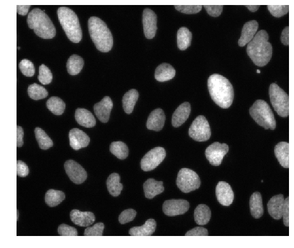
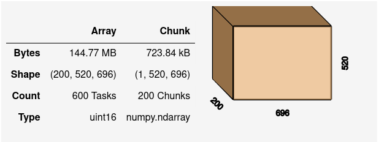
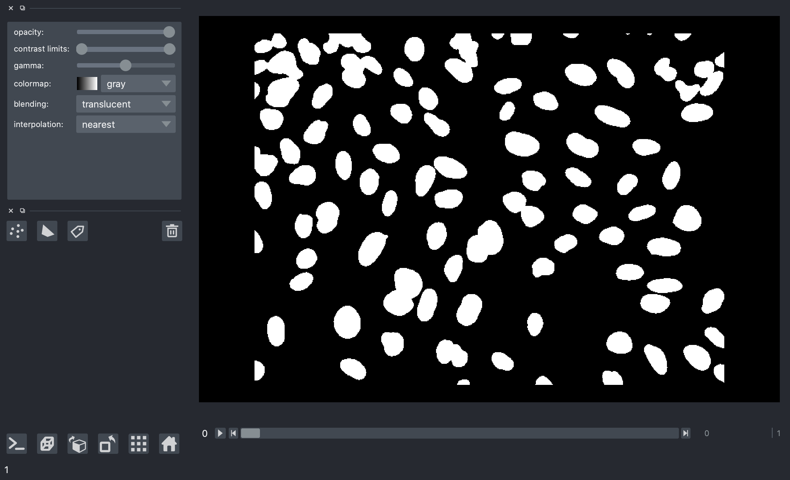
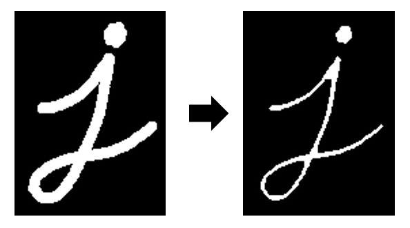
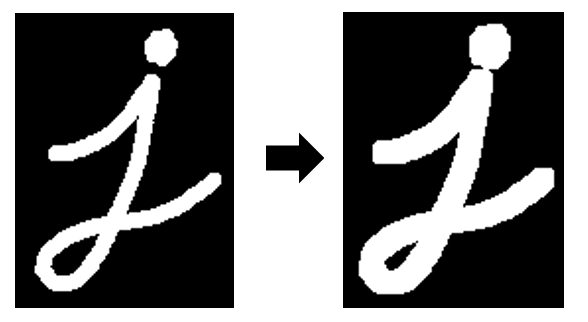
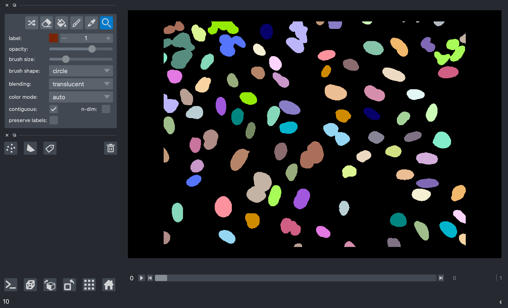
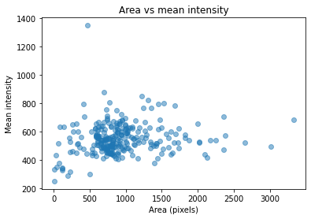



## Executive Summary

A basic image segmentation pipeline

[dask-image](http://image.dask.org/en/latest/)

## Contents
* [Just show me the code](#Just-show-me-the-code)
* [Image segmentation pipeline](#Image-segmentation-pipeline)
    * [Set up your python environment](#Set-up-your-python-environment)
    * [Download the example data](#Download-the-example-data)
    * [Step 1: Reading in data](#Step-1:-Reading-in-data)
    * [Step 2: Filtering images](#Step-2:-Filtering-images)
    * [Step 3: Segmenting objects](#Step-3:-Segmenting-objects)
    * [Step 4: Morphological operations](#Step-4:-Morphological-operations)
    * [Step 5: Measuring objects](#Step-5:-Measuring-objects)
* [Custom functions](#Custom-functions)
* [Scaling up computation](#Scaling-up-computation)
* [Bonus content: using arrays on GPU](#Bonus-content:-using-arrays-on-GPU)

The content of this blog post originally appeared as a conference talk in 2020.

## Just show me the code

If you want to run this yourself, you'll need to download the example data from the Broad Bioimage Benchmark Collection: https://bbbc.broadinstitute.org/BBBC039


And install these requirements:
```
pip install dask-image>=0.4.0 tifffile
```

Here's our full pipeline:

```python
import numpy as np
from dask_image.imread import imread
from dask_image import ndfilters, ndmorph, ndmeasure

images = imread('data/BBBC039/images/*.tif')
smoothed = ndfilters.gaussian_filter(images, sigma=[0, 1, 1])
thresh = ndfilters.threshold_local(smoothed, blocksize=images.chunksize)
threshold_images = smoothed > thresh
structuring_element = np.array([[[0, 0, 0], [0, 0, 0], [0, 0, 0]], [[0, 1, 0], [1, 1, 1], [0, 1, 0]], [[0, 0, 0], [0, 0, 0], [0, 0, 0]]])
binary_images = ndmorph.binary_closing(threshold_image)
label_images, num_features = ndmeasure.label(binary_image)
index = np.arange(num_features)
area = ndmeasure.area(images, label_images, index)
mean_intensity = ndmeasure.mean(images, label_images, index)
```

You can keep reading for a step by step walkthrough of this image segmentation pipeline, or you can skip ahead to the sections on [custom functions](#Custom-functions), [scaling up computation](#Scaling-up-computation), or [GPU acceleration](#Bonus-content:-using-arrays-on-GPU).


## Image segmentation pipeline

Our basic image segmentation pipeline has five steps:

1. Reading in data
2. Filtering images
3. Segmenting objects
4. Morphological operations
5. Measuring objects

### Set up your python environment

Before we begin, we'll need to set up our python virtual environment.

At a minimum, you'll need:
```
pip install dask-image>=0.4.0 tifffile matplotlib
```

Optionally, you can also install the [napari](https://napari.org/) image viewer to visualize the image segmentation.
```
pip install "napari[all]"
```

To use napari from IPython or jupyter, run the `%gui qt` magic in a cell before calling napari. See the [napari documentation](https://napari.org/) for more details.


### Download the example data

We'll use the publically available image dataset [BBBC039](https://bbbc.broadinstitute.org/BBBC039) Caicedo et al. 2018, available from the Broad Bioimage Benchmark Collection [Ljosa et al., Nature Methods, 2012](http://dx.doi.org/10.1038/nmeth.2083). You can download the dataset here: https://bbbc.broadinstitute.org/BBBC039



These are fluorescence microscopy images, where we see the nuclei in individual cells.

### Step 1: Reading in data

Step one in our image segmentation pipeline is to read in the image data. We can do that with the [dask-image imread function](http://image.dask.org/en/latest/dask_image.imread.html).

We pass the path to the folder full of `*.tif` images from our example data.

```python
from dask_image.imread import imread

images = imread('data/BBBC039/images/*.tif')

```



By default, each individual `.tif` file on disk has become one chunk in our Dask array.

### Step 2: Filtering images

Denoising images with a small amount of blur can improve segmentation later on. This is a common first step in a lot of image segmentation pipelines.


```python
from dask_image import ndfilters

smoothed = ndfilters.gaussian_filter(images, sigma=[0, 1, 1])

```

### Step 3: Segmenting objects

#### Absolute threshold
Pixels below the threshold value are background.


```python
absolute_threshold = smoothed > 160
```

Let's have a look at these images with napari. First we'll need to use the `%gui qt` magic:

```python
%gui qt
```

And now we can look a the images with napari:

```python
import napari

viewer = napari.Viewer()
viewer.add_image(absolute_threshold)
viewer.add_image(images, contrast_limits=[0, 2000])
```


#### Local threshold

A better segmentation using local thresholding.


```python
thresh = ndfilters.threshold_local(smoothed, images.chunksize)
threshold_images = smoothed > thresh
```


```python
# Let's take a look at the images
viewer.add_image(threshold_images)
```




### Step 4: Morphological operations

Morphological operations are changes we make to the shape of structures a binary image.


https://docs.opencv.org/3.0-beta/doc/py_tutorials/py_imgproc/py_morphological_ops/py_morphological_ops.html


**Erosion**



**Dilation**



We can combine morphological operations in different ways to get useful effects.

A **morphological opening** operation is an erosion, followed by a dilation.


```python
from dask_image import ndmorph
import numpy as np

structuring_element = np.array([
    [[0, 0, 0], [0, 0, 0], [0, 0, 0]],
    [[0, 1, 0], [1, 1, 1], [0, 1, 0]],
    [[0, 0, 0], [0, 0, 0], [0, 0, 0]]])
binary_images = ndmorph.binary_opening(threshold_images, structure=structuring_element)

```

### Step 5: Measuring objects
Each image has many individual nuclei, so for the sake of time we'll measure a small subset of the data.


```python
from dask_image import ndmeasure

# Create labelled mask
label_images, num_features = ndmeasure.label(binary_images[:3], structuring_element)
index = np.arange(num_features - 1) + 1  # [1, 2, 3, ...num_features]
print("Number of nuclei:", num_features.compute())

```

    Number of nuclei: 271


```python
# Let's look at the labels
viewer.add_labels(label_images)
viewer.dims.set_point(0, 0)
```

Measuring objects (continued)


```python
# Measure objects in images
area = ndmeasure.area(images[:3], label_images, index)
mean_intensity = ndmeasure.mean(images[:3], label_images, index)
```




```python
# Run computation and plot results
import matplotlib.pyplot as plt

plt.scatter(area, mean_intensity, alpha=0.5)
plt.gca().update(dict(title="Area vs mean intensity", xlabel='Area (pixels)', ylabel='Mean intensity'))
plt.show()

```




## Custom functions

What if you want to do something that isn't included?

* scikit-image [apply_parallel()](https://scikit-image.org/docs/dev/api/skimage.util.html#skimage.util.apply_parallel)
* dask [map_overlap](https://docs.dask.org/en/latest/array-overlap.html?highlight=map_overlap#dask.array.map_overlap) / [map_blocks](https://docs.dask.org/en/latest/array-api.html?highlight=map_blocks#dask.array.map_blocks)
* dask [delayed](https://docs.dask.org/en/latest/delayed.html)

## Scaling up computation

Use [dask-distributed](https://distributed.dask.org/en/latest/) to scale up from a laptop onto a supercomputing cluster.

```python
from dask.distributed import Client

# Setup a local cluster
# By default this sets up 1 worker per core
client = Client()
client.cluster

```


## Bonus content: using arrays on GPU

We're able to add GPU support to `dask-image` by using [CuPy](https://cupy.dev/). [CuPy](https://cupy.dev/) is an array library with a numpy-like API, accelerated with NVIDIA CUDA. Instead of having Dask arrays which contain numpy chunks, we can have Dask arrays containing cupy chunks instead.

This [blogpost](https://blog.dask.org/2019/01/03/dask-array-gpus-first-steps) explains the benefits of GPU acceleration and gives some benchmarks for computations on CPU, a single GPU, and multiple GPUs.

### GPU support available in dask-image

For `dask-image` version 0.6.0, there is GPU array support for four of the six subpackages:
* imread
* ndfilters
* ndinterp
* ndmorph

Subpackages of `dask-image` that do not yet have GPU support are.
* ndfourier
* ndmeasure

We hope to add GPU support to these in the future.


### Reading in images onto the GPU

```python
from dask_image.imread import imread

images = imread('data/BBBC039/images/*.tif')
images_on_gpu = imread('data/BBBC039/images/*.tif', arraytype="cupy")

```

###

Remember, you can't mix arrays on the CPU and arrays on the GPU in the same computation.

Here's an example of an image convolution with Dask
```python
# CPU example
import numpy as np
import dask.array as da
from dask_image.ndfilters import convolve

s = (10, 10)
a = da.from_array(np.arange(int(np.prod(s))).reshape(s), chunks=5)
w = np.ones(a.ndim * (3,), dtype=np.float32)
result = convolve(a, w)
result.compute()
```

```python
# Same example moved to the GPU
import cupy  # <- import cupy instead of numpy (version >=7.7.0)
import dask.array as da
from dask_image.ndfilters import convolve

s = (10, 10)
a = da.from_array(cupy.arange(int(cupy.prod(cupy.array(s)))).reshape(s), chunks=5)  # <- cupy dask array
w = cupy.ones(a.ndim * (3,))  # <- cupy array
result = convolve(a, w)
result.compute()
```
